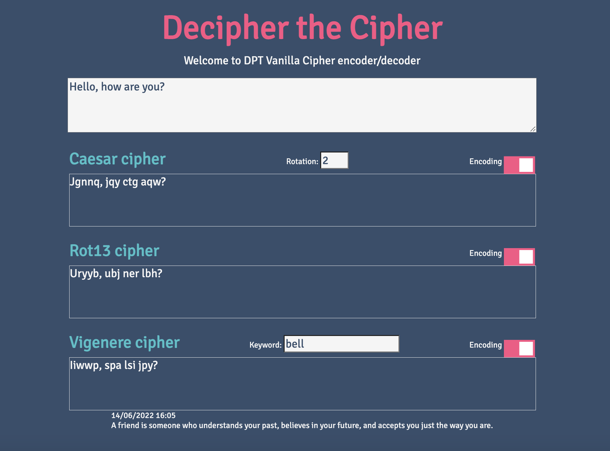

# Decipher the Cipher

A tool to encode or decode text with ease.

## Overview

Decipher the Cipher uses 3 different cipher methods to encode or decode text:

- Caesar cipher: https://en.wikipedia.org/wiki/Caesar_cipher
- Rot13 cipher: https://en.wikipedia.org/wiki/Rot13
- Vigenere cipher: https://en.wikipedia.org/wiki/Vigen%C3%A8re_cipher

Text is encoded/decoded in real-time as you type in text, or as you make changes to the cipher settings such as turning on or off the encoding switch.

### Learning Objective:

My learning objective was to understand how to write a frontend application using vanilla Javascript, rather than using a Javascript framework such as Vue or React.

To set up the base project I followed this article: https://medium.com/the-node-js-collection/modern-javascript-explained-for-dinosaurs-f695e9747b70. This article describes the evolution of using Javascript in the Frontend, and explains the problems that npm and webpack are solving.
